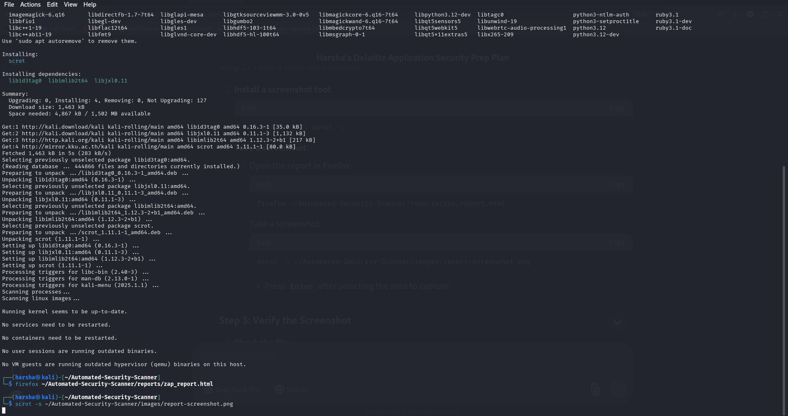

<<<<<<< HEAD
# Automated-Security-Scanner
Python-based DAST tool using OWASP ZAP to automate OWASP Top 10 vulnerability scanning.
=======

>>>>>>> d4e4b5f (Initial commit: Core project files and documentation)
